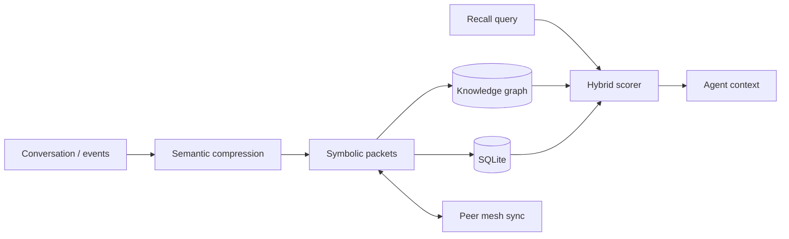

# Noesis

### Semantic-symbolic memory engine for persistent AI agents

[](https://www.python.org/)
[](https://fastapi.tiangolo.com/)
[](LICENSE)
[](https://github.com/veera-1175/Noesis)

> Compress memories into semantic packets, store them as a knowledge graph, sync across agents — then recall with hybrid search that beats raw chat history.

Built by **[veera](https://github.com/veera-1175)**.

---

## Why Noesis exists

Most agent stacks dump full transcripts into a vector DB and call it "memory." That wastes tokens, loses structure, and doesn't share state across agents.

Noesis treats memory as an **engineered substrate**:

| Layer | What it does |
|-------|----------------|
| **Semantic compression** | Clusters related turns into meaning packets |
| **Symbolic encoding** | Tokenizes & packages memories for merge / sync |
| **Knowledge graph** | Entities + relations for structured recall |
| **Hybrid recall** | Graph + embedding similarity with confidence |
| **Forgetting** | Decay + redundancy removal so the store stays sharp |
| **Mesh sync** | Push / pull packets between peer Noesis nodes |

Use it as a **Python library**, a **CLI**, a **FastAPI service** with dashboard, or a **LangChain-compatible** memory backend.

---

## Highlights

- **`NoesisEngine`** — remember / recall / forget / export / peer sync
- **`PersistentAgent`** — agent that accumulates context and suggests system-prompt injections for any LLM
- **REST + live dashboard** — inspect graph, run chat, compare vs traditional dump
- **Docker Compose** — single node or multi-agent profile
- **SQLite-backed** — portable local store; easy to extend

---

## Table of contents

1. [Quick start](#quick-start)
2. [CLI](#cli)
3. [Python API](#python-api)
4. [REST API](#rest-api)
5. [Docker](#docker)
6. [Architecture snapshot](#architecture-snapshot)
7. [Project structure](#project-structure)
8. [Tests](#tests)
9. [Interview walkthrough](#interview-walkthrough)
10. [License](#license)

---

## Quick start

```powershell
git clone https://github.com/veera-1175/Noesis.git
cd Noesis
pip install -e ".[all]"
noesis serve          # Dashboard → http://localhost:8080
```

Minimal library use:

```python
from noesis import NoesisEngine

engine = NoesisEngine()
engine.remember("User prefers Redis for session caching under high write load")
hits = engine.recall("session store choice", mode="hybrid")
```

---

## CLI

```bash
noesis serve                      # FastAPI + dashboard
noesis remember "fact or episode"
noesis recall "query" --mode hybrid
noesis sync-push http://peer:8765
noesis sync-pull http://peer:8765
noesis demo                       # interactive demos
noesis chat                       # terminal persistent agent
```

---

## Python API

```python
from noesis import NoesisEngine
from noesis.agents import PersistentAgent

engine = NoesisEngine()
engine.remember("Scaling discussion: async workers + Redis")
contexts = engine.recall("backend scaling", mode="hybrid")
engine.compare_with_traditional(["asked Redis", "asked workers", "asked scaling"])
engine.sync_from_peer("http://192.168.1.10:8765")

agent = PersistentAgent(agent_id="my-assistant")
out = agent.chat("What do you know about my backend stack?")
print(out["memory_context"])
print(out["suggested_system_prompt"])  # inject into any LLM
```

---

## REST API

| Endpoint | Method | Description |
|----------|--------|-------------|
| `/` | GET | Web dashboard |
| `/docs` | GET | OpenAPI |
| `/health` | GET | Health check |
| `/remember` | POST | Store compressed memory |
| `/recall` | POST | Hybrid graph + semantic recall |
| `/chat` | POST | Remember + recall for assistants |
| `/graph` | GET | Knowledge graph |
| `/memories` | GET | List compressed memories |
| `/compare` | POST | Noesis vs traditional dump |
| `/forget` | POST | Forgetting cycle |

---

## Docker

```bash
docker compose up --build
# http://localhost:8080

docker compose --profile multi-agent up
```

---

## Architecture snapshot



Deep dive: [ARCHITECTURE.md](ARCHITECTURE.md)

---

## Project structure

```
noesis/
├── core/           # Engine orchestrator
├── semantic/       # Compression, clustering, evolution
├── symbolic/       # Tokenization, bytecode, packets
├── graph/          # Knowledge graph + recall
├── sync/           # Mesh server / client
├── forgetting/     # Decay, redundancy
├── recall/         # Predictive recall
├── api/            # FastAPI + dashboard
├── agents/         # PersistentAgent, LangChain bridge
└── storage/        # SQLite
examples/           # Demos
scripts/            # setup / run helpers
```

```powershell
pip install -e .              # Core
pip install -e ".[api]"       # + Dashboard
pip install -e ".[agents]"    # + LangChain
pip install -e ".[all]"       # Everything
```

---

## Tests

```powershell
pytest tests/ -v
```

---

## Interview walkthrough

| Topic | Point to |
|-------|----------|
| Why not “just embeddings”? | Compression + graph + forgetting — token-efficient, structured |
| Multi-agent | Mesh sync of packets between peers |
| Integration | Library, REST, LangChain memory, dashboard |
| Tradeoffs | Local SQLite by default; scale path = external store / workers |

Demo path: `noesis serve` → remember → recall → `/compare` → optional peer sync.

---

## License

MIT © [veera](https://github.com/veera-1175)

**Noesis** — memory that agents can actually keep.
